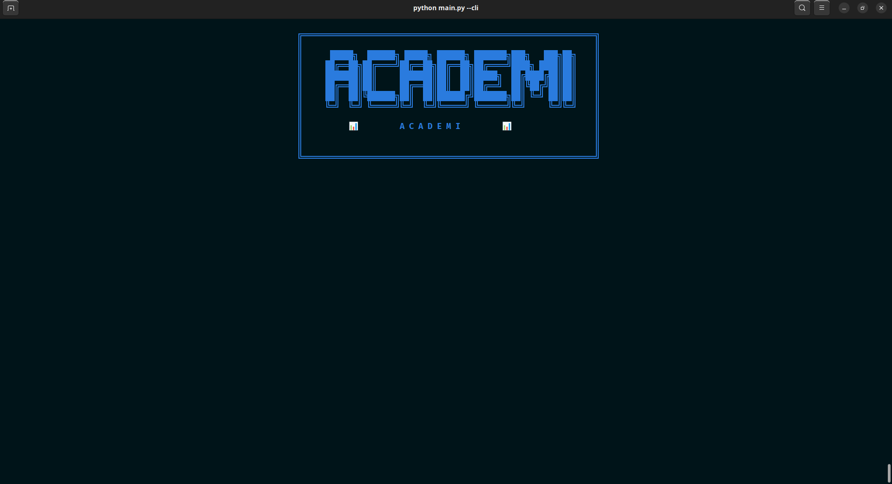
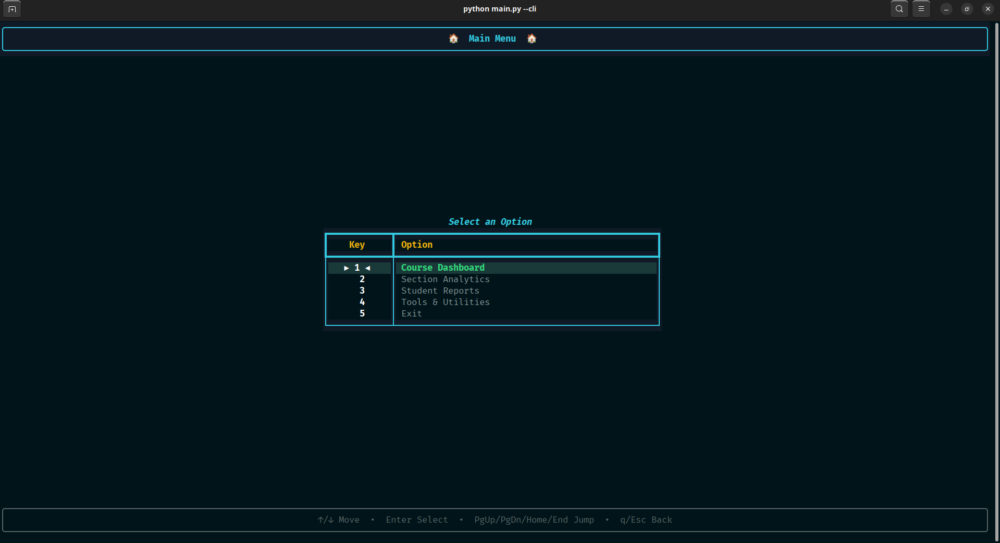
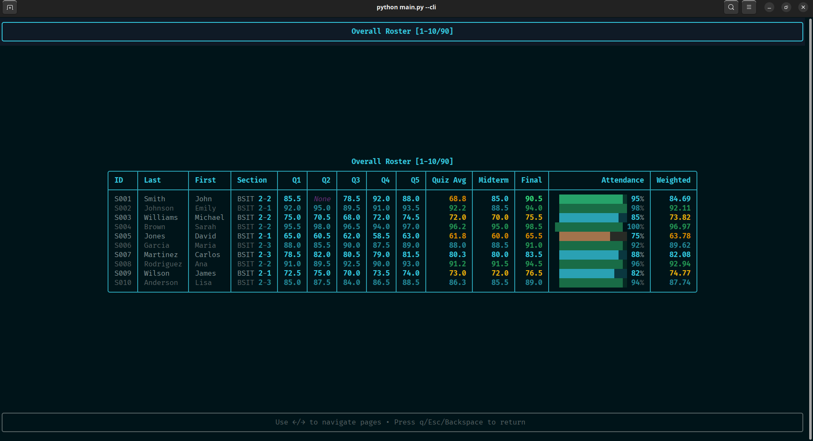
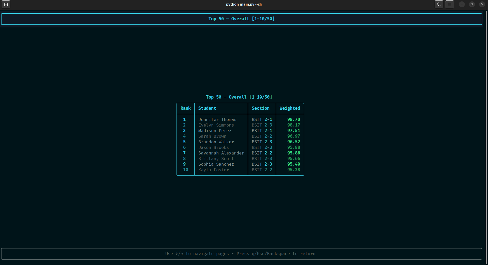

<div id="top" align="center">
  
  
  # Academi
  *A powerful Python-based academic performance analysis system*  
  *that transforms raw student data into actionable insights*

<br>
<div align="center">
  
  
  
  
  
</div>

## 📑 Table of Contents

<p align="center">
  <a href="#about"><strong>🟦 ABOUT</strong></a> &nbsp;|&nbsp;
  <a href="#getting-started"><strong>🟩 GETTING STARTED</strong></a> &nbsp;|&nbsp;
  <a href="#features"><strong>🟪 FEATURES</strong></a> &nbsp;|&nbsp;
  <a href="#architecture"><strong>🟧 ARCHITECTURE</strong></a> &nbsp;|&nbsp;
  <a href="#complexity"><strong>🟥 COMPLEXITY</strong></a> &nbsp;|&nbsp;
  <a href="#team"><strong>🟨 TEAM</strong></a>
</p>
<br>

<h2 id="about" style="text-align:center;">📖 About The Project</h2>

<div align="justified">
<p>This repository showcases a comprehensive academic analytics solution developed as a case study for <strong>Data Structures & Algorithms</strong> course at Polytechnic University of the Philippines – Quezon City. <strong>Academi</strong> demonstrates the practical application of advanced data structures, statistical algorithms, and software engineering best practices to solve real-world educational analytics challenges.</p>

<p>The system ingests student CSV data, computes weighted grades using configurable formulas, groups students by section, surfaces deep insights (grade distributions, rankings, quiz difficulty analysis), and exports comprehensive per-section reports—all through an elegant, interactive Rich-powered CLI or automated showcase mode.</p>
</div>

<div align="center">
  
  
</div>
<div align="center">
  
  
</div>
<div align="center">
  
</div>

<div align="center">
  <h2 id="getting-started">🚀 Getting Started</h2>
  
  <p>
    
    
  </p>
</div>

<div align="center"><h3>⚙️ Prerequisites</h3></div>

<div align="center">
  <table style="width: 600px; border-collapse: collapse; margin-top: 30px;">
    <tr>
      <td align="center" width="100">
        
      </td>
      <td>
        <strong>Python 3.10+</strong> - Required for running the application
        <br/>
        <code>python --version</code> to check if installed
        <br/>
        Download from <a href="https://www.python.org/downloads/">python.org</a>
      </td>
    </tr>
    <tr>
      <td align="center">
        
      </td>
      <td>
        <strong>Git</strong> - Optional, for cloning the repository
        <br/>
        Alternative: Download ZIP from GitHub
      </td>
    </tr>
  </table>
</div>

<div align="center"><h3>📥 Installation Steps</h3></div>

<div align="center">
  <table style="width: 700px; border-collapse: collapse; margin-top: 30px;">
    <tr>
      <td align="center" width="50">1️⃣</td>
      <td>
        <strong>Clone the repository</strong>
        <pre><code>git clone https://github.com/JChristian25/dsa-case-study.git
cd dsa-case-study</code></pre>
      </td>
    </tr>
    <tr>
      <td align="center">2️⃣</td>
      <td>
        <strong>Create a virtual environment</strong>
        <pre><code># Linux/macOS
python -m venv .venv
source .venv/bin/activate

# Windows PowerShell
python -m venv .venv
.venv\Scripts\Activate.ps1

# Windows CMD
python -m venv .venv
.venv\Scripts\activate.bat</code></pre>
      </td>
    </tr>
    <tr>
      <td align="center">3️⃣</td>
      <td>
        <strong>Install dependencies</strong>
        <pre><code>pip install -r requirements.txt</code></pre>
      </td>
    </tr>
    <tr>
      <td align="center">4️⃣</td>
      <td>
        <strong>Run the application</strong>
        <pre><code># Showcase mode (automated demo)
python main.py

# Interactive CLI mode
python main.py --cli</code></pre>
      </td>
    </tr>
  </table>
</div>

<div align="center">
  <details>
    <summary>💡 Troubleshooting Tips</summary>
    <table style="width: 600px; border-collapse: collapse; margin-top: 20px;">
      <tr>
        <td align="center" width="50">⚠️</td>
        <td><strong>Module Not Found:</strong> Ensure virtual environment is activated and dependencies are installed</td>
      </tr>
      <tr>
        <td align="center">⚠️</td>
        <td><strong>Permission Error:</strong> Check write permissions in the <code>output/</code> directory</td>
      </tr>
      <tr>
        <td align="center">⚠️</td>
        <td><strong>CSV File Error:</strong> Verify <code>config.json</code> points to a valid CSV file in <code>data/</code></td>
      </tr>
      <tr>
        <td align="center">⚠️</td>
        <td><strong>Display Issues:</strong> Use a terminal that supports Rich formatting (Windows Terminal, iTerm2, etc.)</td>
      </tr>
    </table>
  </details>
</div>

<div align="center">
  <p>
    After installation, you'll see either the automated showcase or the interactive menu system
  </p>
</div>

<h2 id="features">✨ Features Overview</h2>

<div align="center">
  <table style="width: 900px; border-collapse: collapse; margin-top: 30px;">
    <thead>
      <tr style="background-color: #f0f0f0;">
        <th width="33%">📊 Analytics Engine</th>
        <th width="33%">🎯 Insights & Reporting</th>
        <th width="33%">🛠️ System Features</th>
      </tr>
    </thead>
    <tbody>
      <tr>
        <td>• Weighted grade computation</td>
        <td>• Top/Bottom N rankings</td>
        <td>• Interactive Rich TUI</td>
      </tr>
      <tr>
        <td>• Configurable grade weights</td>
        <td>• Grade letter distributions</td>
        <td>• Automated showcase mode</td>
      </tr>
      <tr>
        <td>• Section-based grouping</td>
        <td>• Hardest quiz identification</td>
        <td>• CSV data export</td>
      </tr>
      <tr>
        <td>• Statistical calculations</td>
        <td>• Cross-section comparisons</td>
        <td>• Configurable thresholds</td>
      </tr>
      <tr>
        <td>• NumPy-powered analytics</td>
        <td>• Improvement tracking</td>
        <td>• Beautiful visualizations</td>
      </tr>
      <tr>
        <td>• Attendance correlation</td>
        <td>• At-risk student detection</td>
        <td>• Menu-driven navigation</td>
      </tr>
    </tbody>
  </table>
</div>
<br>

<details>
  <summary>🔍 View Detailed Feature Matrix</summary>
  
  <h3 style="text-align:center;">Complete Feature Breakdown</h3>
  
  <table style="width: 800px; border-collapse: collapse; margin-top: 30px;">
    <thead>
      <tr style="background-color: #f0f0f0;">
        <th style="padding: 10px;">Category</th>
        <th style="padding: 10px;">Feature</th>
        <th style="padding: 10px;">Description</th>
      </tr>
    </thead>
    <tbody>
      <tr>
        <td style="padding: 10px;" rowspan="3"><strong>📊 Course Dashboard</strong></td>
        <td style="padding: 10px;">Overall Roster</td>
        <td style="padding: 10px;">Complete student listing with computed grades</td>
      </tr>
      <tr>
        <td style="padding: 10px;">Grade Distribution</td>
        <td style="padding: 10px;">Letter grade breakdown with percentages</td>
      </tr>
      <tr>
        <td style="padding: 10px;">Curve Preview</td>
        <td style="padding: 10px;">Visual grade distribution analysis</td>
      </tr>
      <tr>
        <td style="padding: 10px;" rowspan="4"><strong>🎯 Section Analytics</strong></td>
        <td style="padding: 10px;">Section Sorting</td>
        <td style="padding: 10px;">View and sort students within sections</td>
      </tr>
      <tr>
        <td style="padding: 10px;">Quiz Analysis</td>
        <td style="padding: 10px;">Identify hardest topics per section</td>
      </tr>
      <tr>
        <td style="padding: 10px;">Cross-Section Comparison</td>
        <td style="padding: 10px;">Compare quiz performance across sections</td>
      </tr>
      <tr>
        <td style="padding: 10px;">Section Histograms</td>
        <td style="padding: 10px;">Visual grade distribution by section</td>
      </tr>
      <tr>
        <td style="padding: 10px;" rowspan="3"><strong>📈 Performance Insights</strong></td>
        <td style="padding: 10px;">Improvement Tracking</td>
        <td style="padding: 10px;">Midterm → Final grade progression</td>
      </tr>
      <tr>
        <td style="padding: 10px;">Attendance Correlation</td>
        <td style="padding: 10px;">Analyze attendance impact on grades</td>
      </tr>
      <tr>
        <td style="padding: 10px;">At-Risk Detection</td>
        <td style="padding: 10px;">Identify students below threshold</td>
      </tr>
      <tr>
        <td style="padding: 10px;" rowspan="2"><strong>🛠️ Utilities</strong></td>
        <td style="padding: 10px;">Data Management</td>
        <td style="padding: 10px;">Load, reload, insert, delete operations</td>
      </tr>
      <tr>
        <td style="padding: 10px;">Custom Plotting</td>
        <td style="padding: 10px;">Generate custom visualizations</td>
      </tr>
    </tbody>
  </table>
</details>

<h2 id="architecture">🏗️ System Architecture</h2>

<div align="center">
  
  
</div>
<br>

<div align="center">
  <table style="width: 900px; border-collapse: collapse; margin-top: 20px;">
    <tr>
      <td align="center" width="33%">
        <h3>🎨 Presentation Layer</h3>
        <code>app/cli.py</code><br>
        <code>app/showcase.py</code>
      </td>
      <td align="center" width="33%">
        <h3>⚙️ Business Logic</h3>
        <code>app/core.py</code><br>
        <code>app/analytics/</code>
      </td>
      <td align="center" width="33%">
        <h3>📊 Data & Reporting</h3>
        <code>app/reporting/</code><br>
        <code>config.json</code>
      </td>
    </tr>
  </table>
</div>

<details>
  <summary><span style="font-size: 20px; font-weight:700;">🎨 Presentation Layer Components</span></summary>
  
  <table style="width: 800px; border-collapse: collapse; margin-top: 20px;">
    <tr>
      <td align="center" width="60">
        <h4>🖥️</h4>
      </td>
      <td>
        <strong>cli.py - Interactive Command Line Interface</strong>
        <ul>
          <li>Rich-powered menu system with navigation</li>
          <li>Paginated table displays</li>
          <li>Color-coded insights and warnings</li>
          <li>Dynamic user input handling</li>
        </ul>
        <pre><code>Features:
• Course Dashboard (roster, distributions, rankings)
• Section Analytics (comparisons, correlations)
• Student Reports (exports, lookups)
• Tools & Utilities (data management, plotting)</code></pre>
      </td>
    </tr>
    <tr>
      <td align="center">
        <h4>🎬</h4>
      </td>
      <td>
        <strong>showcase.py - Automated Demonstration Mode</strong>
        <ul>
          <li>Scripted presentation of key features</li>
          <li>Timed display of analytics and insights</li>
          <li>Professional formatting for demonstrations</li>
          <li>Non-interactive curated flow</li>
        </ul>
      </td>
    </tr>
  </table>
</details>

<details>
  <summary><span style="font-size: 20px; font-weight:700;">⚙️ Business Logic Layer Components</span></summary>
  
  <table style="width: 800px; border-collapse: collapse; margin-top: 20px;">
    <tr>
      <td align="center" width="60">
        <h4>🔧</h4>
      </td>
      <td>
        <strong>core.py - Data Processing Engine</strong>
        <ul>
          <li>CSV parsing with validation and error handling</li>
          <li>Weighted grade calculation algorithms</li>
          <li>Section-based data grouping</li>
          <li>Student record management</li>
        </ul>
        <pre><code>def read_csv_data(csv_file, cfg):
    """
    O(R × C) parsing with validation
    • Range checks on numeric values
    • String trimming and normalization
    • Error collection and reporting
    """</code></pre>
      </td>
    </tr>
    <tr>
      <td align="center">
        <h4>📐</h4>
      </td>
      <td>
        <strong>analytics/stats.py - Statistical Analysis</strong>
        <ul>
          <li>Basic statistics (mean, median, std dev)</li>
          <li>Ranking algorithms (top/bottom N)</li>
          <li>Grade letter distribution</li>
          <li>Performance comparison utilities</li>
        </ul>
      </td>
    </tr>
    <tr>
      <td align="center">
        <h4>🔢</h4>
      </td>
      <td>
        <strong>analytics/numpy_stats.py - NumPy-Powered Analytics</strong>
        <ul>
          <li>Advanced correlation analysis</li>
          <li>Vectorized statistical computations</li>
          <li>Efficient array operations</li>
          <li>High-performance data transformations</li>
        </ul>
      </td>
    </tr>
    <tr>
      <td align="center">
        <h4>💡</h4>
      </td>
      <td>
        <strong>analytics/insights.py - Intelligence Layer</strong>
        <ul>
          <li>Hardest quiz identification</li>
          <li>Cross-section performance analysis</li>
          <li>Improvement trend detection</li>
          <li>At-risk student flagging</li>
        </ul>
      </td>
    </tr>
  </table>
</details>

<details>
  <summary><span style="font-size: 20px; font-weight:700;">📊 Data & Reporting Layer Components</span></summary>
  
  <table style="width: 800px; border-collapse: collapse; margin-top: 20px;">
    <tr>
      <td align="center" width="60">
        <h4>📁</h4>
      </td>
      <td>
        <strong>reporting/exporter.py - Data Export Engine</strong>
        <ul>
          <li>CSV file generation per section</li>
          <li>Formatted report creation</li>
          <li>Automatic directory management</li>
          <li>Custom column configuration</li>
        </ul>
      </td>
    </tr>
    <tr>
      <td align="center">
        <h4>📈</h4>
      </td>
      <td>
        <strong>reporting/plotting.py - Visualization System</strong>
        <ul>
          <li>Matplotlib-based histogram generation</li>
          <li>Grade distribution plots</li>
          <li>Section-specific visualizations</li>
          <li>Customizable chart styling</li>
        </ul>
      </td>
    </tr>
    <tr>
      <td align="center">
        <h4>📋</h4>
      </td>
      <td>
        <strong>reporting/tables.py - Rich Table Rendering</strong>
        <ul>
          <li>Beautiful console tables with Rich</li>
          <li>Dynamic column sizing</li>
          <li>Color-coded grade displays</li>
          <li>Pagination support</li>
        </ul>
      </td>
    </tr>
  </table>
</details>
<br>

<details>
  <summary><span style="font-size: 20px; font-weight:700;">📂 Project Structure</span></summary>

<pre><code>📁 Academi/
├── 📄 main.py                      # Application entry point
├── 📄 config.json                  # Configuration file
├── 📄 requirements.txt             # Python dependencies
├── 📄 README.md                    # This documentation
│
├── 📁 app/                         # Main application package
│   ├── 📄 __init__.py
│   ├── 📄 cli.py                   # Interactive CLI interface
│   ├── 📄 core.py                  # Core data processing
│   ├── 📄 showcase.py              # Automated demonstration
│   │
│   ├── 📁 analytics/               # Analytics modules
│   │   ├── 📄 __init__.py
│   │   ├── 📄 stats.py             # Basic statistics
│   │   ├── 📄 numpy_stats.py       # NumPy analytics
│   │   └── 📄 insights.py          # Intelligence layer
│   │
│   └── 📁 reporting/               # Reporting & visualization
│       ├── 📄 __init__.py
│       ├── 📄 exporter.py          # CSV export
│       ├── 📄 plotting.py          # Matplotlib charts
│       └── 📄 tables.py            # Rich tables
│
├── 📁 data/                        # Input data directory
│   ├── 📄 input_bsit.csv           # Sample dataset
│   ├── 📄 input.csv                # Generic dataset
│   └── 📄 input_with_errors.csv    # Test dataset
│
├── 📁 output/                      # Generated reports
│   ├── 📄 section_*_report.csv     # Section reports
│   └── 📁 plots/                   # Visualization outputs
│
└── 📁 tests/                       # Unit tests
    ├── 📄 __init__.py
    └── 📄 test_numpy_stats.py      # NumPy analytics tests
</code></pre>
</details>

<h2>⚙️ Configuration</h2>

The system is highly configurable through `config.json`:

```json
{
  "file_paths": {
    "input_csv": "data/input_bsit.csv",
    "output_dir": "output/"
  },
  "grade_weights": {
    "quizzes_total": 0.20,
    "midterm": 0.35,
    "final": 0.35,
    "attendance": 0.10
  },
  "thresholds": {
    "at_risk_cutoff": 70.0,
    "grade_letters": {
      "A": 90, "B": 80, "C": 70, "D": 60
    }
  }
}
```

<details>
  <summary>📝 Configuration Options Explained</summary>
  
  <table style="width: 800px; border-collapse: collapse; margin-top: 20px;">
    <thead>
      <tr style="background-color: #f0f0f0;">
        <th style="padding: 10px;">Setting</th>
        <th style="padding: 10px;">Purpose</th>
        <th style="padding: 10px;">Example Values</th>
      </tr>
    </thead>
    <tbody>
      <tr>
        <td style="padding: 10px;"><code>input_csv</code></td>
        <td style="padding: 10px;">Path to student data CSV file</td>
        <td style="padding: 10px;"><code>"data/input_bsit.csv"</code></td>
      </tr>
      <tr>
        <td style="padding: 10px;"><code>output_dir</code></td>
        <td style="padding: 10px;">Directory for generated reports</td>
        <td style="padding: 10px;"><code>"output/"</code></td>
      </tr>
      <tr>
        <td style="padding: 10px;"><code>quizzes_total</code></td>
        <td style="padding: 10px;">Weight for all quizzes combined</td>
        <td style="padding: 10px;"><code>0.20</code> (20%)</td>
      </tr>
      <tr>
        <td style="padding: 10px;"><code>midterm</code></td>
        <td style="padding: 10px;">Weight for midterm exam</td>
        <td style="padding: 10px;"><code>0.35</code> (35%)</td>
      </tr>
      <tr>
        <td style="padding: 10px;"><code>final</code></td>
        <td style="padding: 10px;">Weight for final exam</td>
        <td style="padding: 10px;"><code>0.35</code> (35%)</td>
      </tr>
      <tr>
        <td style="padding: 10px;"><code>attendance</code></td>
        <td style="padding: 10px;">Weight for attendance</td>
        <td style="padding: 10px;"><code>0.10</code> (10%)</td>
      </tr>
      <tr>
        <td style="padding: 10px;"><code>at_risk_cutoff</code></td>
        <td style="padding: 10px;">Grade below which students are flagged</td>
        <td style="padding: 10px;"><code>70.0</code></td>
      </tr>
      <tr>
        <td style="padding: 10px;"><code>grade_letters</code></td>
        <td style="padding: 10px;">Minimum scores for letter grades</td>
        <td style="padding: 10px;"><code>A: 90, B: 80, C: 70, D: 60</code></td>
      </tr>
    </tbody>
  </table>
</details>

<h2>💻 Usage Modes</h2>

<div align="center">
  <table style="width: 800px; border-collapse: collapse; margin-top: 20px;">
    <thead>
      <tr style="background-color: #f0f0f0;">
        <th width="50%">🎬 Showcase Mode</th>
        <th width="50%">🖥️ Interactive CLI Mode</th>
      </tr>
    </thead>
    <tbody>
      <tr>
        <td style="padding: 15px; vertical-align: top;">
          <strong>Purpose:</strong> Automated demonstration<br><br>
          <strong>Run:</strong> <code>python main.py</code><br><br>
          <strong>Features:</strong>
          <ul>
            <li>Scripted presentation</li>
            <li>Curated insights sequence</li>
            <li>Timed displays</li>
            <li>Perfect for demos</li>
          </ul>
        </td>
        <td style="padding: 15px; vertical-align: top;">
          <strong>Purpose:</strong> Interactive exploration<br><br>
          <strong>Run:</strong> <code>python main.py --cli</code><br><br>
          <strong>Features:</strong>
          <ul>
            <li>Menu-driven navigation</li>
            <li>User-controlled flow</li>
            <li>Full feature access</li>
            <li>Data manipulation</li>
          </ul>
        </td>
      </tr>
    </tbody>
  </table>
</div>

<details>
  <summary>🎮 CLI Menu Structure</summary>

<pre><code>
╔═══════════════════════════════════════════════════════════╗
║           ACADEMI - MAIN MENU             ║
╠═══════════════════════════════════════════════════════════╣
║  1. 📊 Course Dashboard                                   ║
║     → Overall Roster, Rankings, Grade Distributions       ║
║                                                            ║
║  2. 🎯 Section Analytics                                  ║
║     → Section Comparisons, Quiz Analysis, Correlations    ║
║                                                            ║
║  3. 📋 Student Reports                                    ║
║     → At-Risk List, CSV Export, Student Lookup            ║
║                                                            ║
║  4. 🛠️  Tools & Utilities                                 ║
║     → Data Management, Custom Plotting, Configuration     ║
║                                                            ║
║  5. 🚪 Exit                                               ║
╚═══════════════════════════════════════════════════════════╝
</code></pre>
</details>

<h2 id="complexity">🔬 Algorithm Complexity Analysis</h2>

<div align="center">
  
</div>
<br>

Our implementation focuses on algorithmic efficiency while maintaining code readability.

<details>
  <summary><span style="font-size: 20px; font-weight:700;">📊 Core Algorithms</span></summary>

<h3>CSV Data Reading & Parsing</h3>

**Function:** `read_csv_data()` in `app/core.py`

```python
def read_csv_data(csv_file, cfg):
    """
    Parse CSV and validate data with error handling
    """
    # Single pass with csv.DictReader
    # Row-by-row field processing
    # Range validation on numeric values
```

**Complexity Analysis:**
- **Time:** `O(R × C)` where:
  - `R` = number of rows (students)
  - `C` = number of columns (fields per student)
  - Each cell processed in `O(1)` (strip, parse, validate)
  
- **Space:** `O(R × C)` for storing row dictionaries
  - Transient memory: `O(C)` per row
  - Final memory: dominated by accumulated output list

**Justification:** Single-pass parsing is optimal for CSV processing. We cannot do better than reading every cell at least once.

---

<h3>Section Grouping</h3>

**Function:** `group_by_section()` in `app/core.py`

```python
def group_by_section(data):
    """
    Group students by section using dictionary lookup
    """
    sections = {}
    for student in data:
        section = student.get('section')
        sections.setdefault(section, []).append(student)
```

**Complexity Analysis:**
- **Time:** `O(n)` where `n` = number of students
  - Single iteration through data
  - Dictionary lookup/insert: `O(1)` average
  
- **Space:** `O(n)` for grouped dictionary
  - No duplication of student data (references only)

---

<h3>Ranking & Sorting</h3>

**Function:** `get_top_n()`, `get_bottom_n()` in `app/analytics/stats.py`

```python
def get_top_n(data, n, key='final_grade'):
    """
    Get top N students by specified metric
    """
    return sorted(data, key=lambda x: x[key], reverse=True)[:n]
```

**Complexity Analysis:**
- **Time:** `O(n log n)` where `n` = number of students
  - Python's Timsort algorithm (optimized merge sort)
  - Slicing top N: `O(n)` (but dominated by sort)
  
- **Space:** `O(n)` for sorted copy
  - Non-destructive sorting (preserves original)

**Optimization Opportunity:** For very large datasets, could use heap-based selection in `O(n log k)` where `k = N`, but current approach is simpler and sufficient for typical class sizes.

---

<h3>Statistical Calculations</h3>

**Functions:** `calculate_mean()`, `calculate_median()`, `calculate_std()` in `app/analytics/stats.py`

```python
def calculate_mean(values):
    """Calculate arithmetic mean"""
    return sum(values) / len(values) if values else 0

def calculate_std(values):
    """Calculate standard deviation"""
    mean = calculate_mean(values)
    variance = sum((x - mean) ** 2 for x in values) / len(values)
    return variance ** 0.5
```

**Complexity Analysis:**
- **Mean:** `O(n)` - single pass summation
- **Median:** `O(n log n)` - requires sorting
- **Std Dev:** `O(n)` - two passes (mean, then variance)

Where `n` = number of values in the dataset

---

<h3>Correlation Analysis (NumPy-Powered)</h3>

**Function:** `numpy_correlation()` in `app/analytics/numpy_stats.py`

```python
def numpy_correlation(x_values, y_values):
    """
    Calculate Pearson correlation using NumPy
    """
    return np.corrcoef(x_values, y_values)[0, 1]
```

**Complexity Analysis:**
- **Time:** `O(n)` - NumPy vectorized operations
  - Highly optimized C implementation
  - SIMD instructions for parallel computation
  
- **Space:** `O(n)` for NumPy arrays

**Performance:** NumPy is 10-100x faster than pure Python for numeric operations on large datasets due to vectorization.

</details>

<details>
  <summary><span style="font-size: 20px; font-weight:700;">🎯 Data Structure Choices</span></summary>

<h3>Why These Data Structures?</h3>

<table style="width: 800px; border-collapse: collapse; margin-top: 20px;">
  <thead>
    <tr style="background-color: #f0f0f0;">
      <th style="padding: 10px;">Data Structure</th>
      <th style="padding: 10px;">Use Case</th>
      <th style="padding: 10px;">Rationale</th>
    </tr>
  </thead>
  <tbody>
    <tr>
      <td style="padding: 10px;"><strong>List (Array)</strong></td>
      <td style="padding: 10px;">Primary student storage</td>
      <td style="padding: 10px;">
        • Sequential access patterns<br>
        • Sorting requirements<br>
        • Iteration-heavy operations
      </td>
    </tr>
    <tr>
      <td style="padding: 10px;"><strong>Dictionary (Hash Map)</strong></td>
      <td style="padding: 10px;">Section grouping, student lookup</td>
      <td style="padding: 10px;">
        • O(1) average lookup time<br>
        • Natural key-value mapping<br>
        • Efficient for grouping operations
      </td>
    </tr>
    <tr>
      <td style="padding: 10px;"><strong>NumPy Array</strong></td>
      <td style="padding: 10px;">Numerical computations</td>
      <td style="padding: 10px;">
        • Vectorized operations<br>
        • Memory efficiency<br>
        • Fast correlation/statistics
      </td>
    </tr>
  </tbody>
</table>

</details>

<details>
  <summary><span style="font-size: 20px; font-weight:700;">⚡ Performance Considerations</span></summary>

<h3>Optimization Strategies Implemented</h3>

1. **Lazy Evaluation**
   - Visualizations generated only when requested
   - Reports exported on demand
   - Reduces unnecessary computation

2. **Caching**
   - Calculated grades stored in student dictionaries
   - Section groupings persisted after first computation
   - Avoids redundant calculations

3. **Efficient Algorithms**
   - Single-pass CSV parsing
   - Dictionary-based grouping (vs. nested loops)
   - NumPy for numerical operations

4. **Memory Management**
   - No unnecessary data duplication
   - References used for grouping
   - Matplotlib figures explicitly closed

<h3>Scalability</h3>

Current implementation handles:
- ✅ **100-1000 students:** Excellent performance (<1s)
- ✅ **1000-10000 students:** Good performance (1-5s)
- ⚠️ **10000+ students:** Consider database for better performance

For enterprise-scale deployments, consider:
- Database integration (PostgreSQL, SQLite)
- Batch processing for large datasets
- Indexed lookups for student search
- Incremental report generation

</details>

<h2 id="team">👥 Meet The Team</h2>

<div align="center">
  <h3>BSIT 2-2 S.Y. 2024-2025</h3>
  <p>Polytechnic University of the Philippines – Quezon City</p>
  <p><em>Data Structures & Algorithms Case Study</em></p>
</div>

<table align="center">
  <tr>
    <td align="center">
      <a href="https://github.com/JChristian25">
        <br/>
        <sub><b>John Christian Linaban</b></sub><br/>
        <sub>@JChristian25</sub><br/>
        <sub><i>Full‑Stack Developer</i></sub>
      </a>
    </td>
    <td align="center">
      <a href="https://github.com/jeop-qrs">
        <br/>
        <sub><b>Jeoffrey Isaiah Hernandez</b></sub><br/>
        <sub>@jeop-qrs</sub><br/>
        <sub><i>Backend Developer</i></sub>
      </a>
    </td>
    <td align="center">
      <a href="https://github.com/yyxy0">
        <br/>
        <sub><b>Daniel Go Micompal</b></sub><br/>
        <sub>@yyxy0</sub><br/>
        <sub><i>Backend Developer</i></sub>
      </a>
    </td>
  </tr>
  <tr>
    <td align="center">
      <a href="https://github.com/Cursed-10">
        <br/>
        <sub><b>Kirsten Licup</b></sub><br/>
        <sub>@Cursed-10</sub><br/>
        <sub><i>Frontend Developer</i></sub>
      </a>
    </td>
    <td align="center">
      <a href="https://github.com/marymargaretteviray15-hub">
        <br/>
        <sub><b>Mary Margarette Viray</b></sub><br/>
        <sub>@marymargaretteviray15-hub</sub><br/>
        <sub><i>Frontend Developer</i></sub>
      </a>
    </td>
    <td align="center">
      <a href="https://github.com/PumpkinDelirious">
        <br/>
        <sub><b>John Miles Varca</b></sub><br/>
        <sub>@PumpkinDelirious</sub><br/>
        <sub><i>Backend Developer</i></sub>
      </a>
    </td>
  </tr>
</table>


<h2>🎓 Learning Outcomes</h2>

<div align="center">
  <p><em>Key Computer Science concepts demonstrated in this project</em></p>
</div>

<details>
  <summary><span style="font-size: 20px; font-weight:700;">📚 Data Structures & Algorithms</span></summary>
  
  <table style="width: 800px; border-collapse: collapse; margin-top: 20px;">
    <thead>
      <tr style="background-color: #f0f0f0;">
        <th style="padding: 10px;">Concept</th>
        <th style="padding: 10px;">Implementation</th>
        <th style="padding: 10px;">Application</th>
      </tr>
    </thead>
    <tbody>
      <tr>
        <td style="padding: 10px;"><strong>Hash Tables</strong></td>
        <td style="padding: 10px;">Python dictionaries</td>
        <td style="padding: 10px;">Section grouping, student lookup</td>
      </tr>
      <tr>
        <td style="padding: 10px;"><strong>Sorting Algorithms</strong></td>
        <td style="padding: 10px;">Timsort (Python's sorted())</td>
        <td style="padding: 10px;">Student rankings, grade ordering</td>
      </tr>
      <tr>
        <td style="padding: 10px;"><strong>Statistical Algorithms</strong></td>
        <td style="padding: 10px;">Mean, median, std dev, correlation</td>
        <td style="padding: 10px;">Grade analytics, insights generation</td>
      </tr>
      <tr>
        <td style="padding: 10px;"><strong>Array Operations</strong></td>
        <td style="padding: 10px;">NumPy vectorization</td>
        <td style="padding: 10px;">Fast numerical computations</td>
      </tr>
    </tbody>
  </table>
</details>

<details>
  <summary><span style="font-size: 20px; font-weight:700;">🏗️ Software Engineering Principles</span></summary>
  
  <ul>
    <li><strong>Modularity:</strong> Separation of concerns across app/, analytics/, and reporting/</li>
    <li><strong>DRY (Don't Repeat Yourself):</strong> Reusable functions for common operations</li>
    <li><strong>Configuration Management:</strong> Externalized settings via config.json</li>
    <li><strong>Error Handling:</strong> Comprehensive validation and exception management</li>
    <li><strong>Code Readability:</strong> Clear naming, documentation, and structure</li>
    <li><strong>Testing:</strong> Unit tests for critical analytics functions</li>
  </ul>
</details>

<details>
  <summary><span style="font-size: 20px; font-weight:700;">💡 Problem-Solving Approach</span></summary>
  
  <h3>Development Methodology</h3>
  
  <table style="width: 800px; border-collapse: collapse; margin-top: 20px;">
    <tr>
      <td align="center" width="60">1️⃣</td>
      <td><strong>Requirements Analysis</strong> - Identified key features for academic analytics</td>
    </tr>
    <tr>
      <td align="center">2️⃣</td>
      <td><strong>Data Modeling</strong> - Designed CSV structure and student data representation</td>
    </tr>
    <tr>
      <td align="center">3️⃣</td>
      <td><strong>Algorithm Selection</strong> - Chose efficient algorithms for each operation</td>
    </tr>
    <tr>
      <td align="center">4️⃣</td>
      <td><strong>Modular Implementation</strong> - Built components independently for reusability</td>
    </tr>
    <tr>
      <td align="center">5️⃣</td>
      <td><strong>Integration & Testing</strong> - Combined modules and validated functionality</td>
    </tr>
    <tr>
      <td align="center">6️⃣</td>
      <td><strong>UI/UX Polish</strong> - Enhanced presentation with Rich library</td>
    </tr>
  </table>
</details>

<h2>📊 Sample Data Format</h2>

<details>
  <summary>View CSV Structure</summary>

The input CSV should follow this structure:

```csv
student_id,last_name,first_name,section,quiz1,quiz2,quiz3,quiz4,quiz5,midterm,final,attendance_percent
2024-001,Dela Cruz,Juan,BSIT 2-1,85,90,88,92,87,86,89,95
2024-002,Santos,Maria,BSIT 2-1,78,82,80,85,83,81,84,90
2024-003,Reyes,Pedro,BSIT 2-2,92,95,93,90,94,91,93,100
```

**Required Columns:**
- `student_id` - Unique identifier
- `last_name`, `first_name` - Student name
- `section` - Class section
- `quiz1` through `quiz5` - Quiz scores (0-100)
- `midterm`, `final` - Exam scores (0-100)
- `attendance_percent` - Attendance percentage (0-100)

</details>

<h2>🐛 Known Issues & Limitations</h2>

<details>
  <summary>View Current Limitations</summary>

<table style="width: 800px; border-collapse: collapse; margin-top: 20px;">
  <thead>
    <tr style="background-color: #f0f0f0;">
      <th style="padding: 10px;">Issue</th>
      <th style="padding: 10px;">Impact</th>
      <th style="padding: 10px;">Workaround</th>
    </tr>
  </thead>
  <tbody>
    <tr>
      <td style="padding: 10px;">Large datasets (>10k students)</td>
      <td style="padding: 10px;">Slower performance</td>
      <td style="padding: 10px;">Split into multiple CSV files by section</td>
    </tr>
    <tr>
      <td style="padding: 10px;">Terminal compatibility</td>
      <td style="padding: 10px;">Rich formatting may not display properly</td>
      <td style="padding: 10px;">Use modern terminal (Windows Terminal, iTerm2)</td>
    </tr>
    <tr>
      <td style="padding: 10px;">Missing data handling</td>
      <td style="padding: 10px;">Errors on incomplete records</td>
      <td style="padding: 10px;">Ensure all required fields are populated</td>
    </tr>
  </tbody>
</table>

</details>

<h2>📝 License & Attribution</h2>

<div align="center">
  <p>This project is an academic case study developed for educational purposes.</p>
  <p><strong>Course:</strong> Data Structures & Algorithms</p>
  <p><strong>Institution:</strong> Polytechnic University of the Philippines – Quezon City</p>
  <p><strong>Academic Year:</strong> 2025-2026</p>
  <br>
  <p>
    
    
  </p>
</div>

<h2>🙏 Acknowledgments</h2>

<div align="center">
  <h3>✨ Special Thanks ✨</h3>
  
  <table style="width: 700px; border-collapse: collapse; margin-top: 20px;">
    <tr>
      <td align="center" style="padding: 15px;">
        <h4>👨‍🏫 Our Professor</h4>
        <p>For invaluable guidance in Data Structures & Algorithms<br>and inspiring us to build practical solutions</p>
      </td>
    </tr>
    <tr>
      <td align="center" style="padding: 15px;">
        <h4>🏛️ Polytechnic University of the Philippines</h4>
        <p>For providing excellent education and resources<br>that made this project possible</p>
      </td>
    </tr>
    <tr>
      <td align="center" style="padding: 15px;">
        <h4>💻 Open Source Community</h4>
        <p>For the amazing libraries that power this project:<br>
        <a href="https://github.com/Textualize/rich">Rich</a> • 
        <a href="https://numpy.org/">NumPy</a> • 
        <a href="https://matplotlib.org/">Matplotlib</a></p>
      </td>
    </tr>
    <tr>
      <td align="center" style="padding: 15px;">
        <h4>👥 Our Classmates & Peers</h4>
        <p>For feedback, testing, and collaboration<br>throughout the development process</p>
      </td>
    </tr>
  </table>
</div>

---

<div align="center">
  <p>
    <strong>Made with ❤️ by BSIT 2-2 students at PUP Quezon City</strong>
  </p>
  <p>
    <a href="#top">⬆️ Back to Top</a>
  </p>
  
  <br>
  
  <p>
    <em>"Transforming data into insights, one student at a time."</em>
  </p>
</div>
